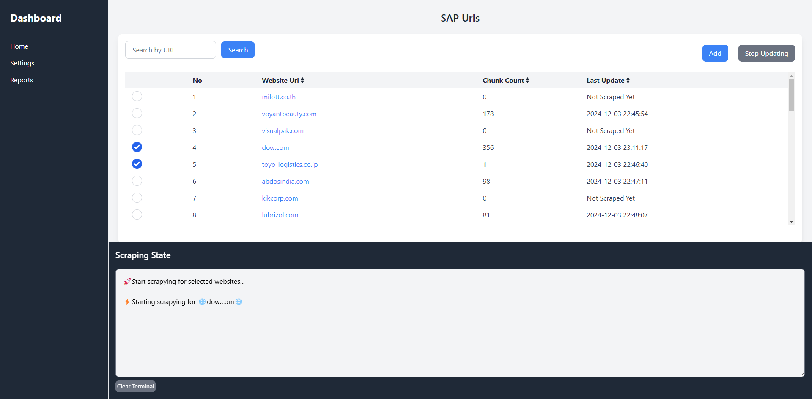
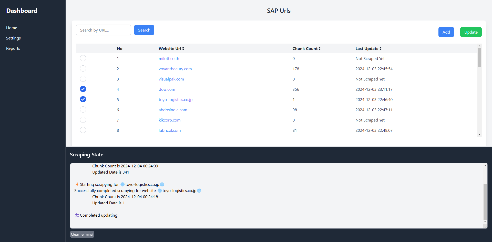

# SAP Bot

## Description

The SAP bot is an AI-powered chatbot that leverages scraped data to answer user inquiries about a wide range of online SAP suppliers. It extracts information such as products, capabilities/services, certifications, and locations from numerous suppliers across the web using Firecrawl.

## Features

- **AI-Powered Chatbot**  
  Utilizes advanced AI and Natural Language Processing (NLP) to interpret and respond to user queries about SAP suppliers intelligently and contextually.

- **Scalable Architecture**  
  Designed to support an extensive number of SAP suppliers. The bot can scale easily to accommodate new suppliers and handle growing datasets efficiently.

- **User-Friendly Admin Dashboard**  
  Features an intuitive GUI-based dashboard for administrators to manage configurations, monitor the scraping process, and analyze data without requiring coding knowledge.

- **Real-Time Query Responses**  
  Delivers accurate and up-to-date responses instantly, retrieving relevant information from scraped supplier data on demand.

## Technologies Used

- **Programming Languages**: Python, TailwindCSS, JavaScript
- **Libraries & Frameworks**: Django, Langchain, RAG, Firecrawl
- **API Services**: OpenAI, Ollama Embedding
- **Database**: SQL, ChromaDB

## Installation

### Prerequisites

- Python 3.x
- Node.js
- Ollama

### Installation Steps

1. Clone the repository:
   ```bash
   git clone https://github.com/steveliu1110/SAPbot.git
   cd SAPbot
   ```

2. Install the required dependencies:
   ```bash
   pip install -r requirements.txt
   python manage.py tailwindcss build
   ```

3. Set up environment variables:
     ```bash
     #Create a `.env` file and add your keys:
     FIRECRAWL_API_KEY=your-key-here
     OPENAI_API_KEY=your-key-here
     CHROMA_STORAGE_PATH=./chroma
     OLLAMA_EMBEDDING_MODEL=nomic-embed-text
     ```

4. Pull the Ollama embedding model and serve it:
   ```bash
   ollama pull
   ollama serve
   ```

5. Run the chatbot:
   ```bash
   python manage.py runserver
   python manage.py tailwindcss start
   ```

## Preview

1. **Chatbot Admin Dashboard**  
   

2. **Chatbot User Dashboard**  
   

## License

This project is licensed under the MIT License - see the [LICENSE](LICENSE) file for details.
